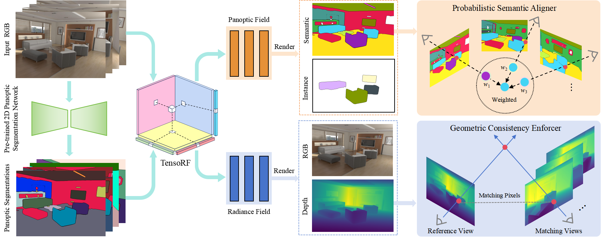

<p align="center"> 

</p>

# Multi-view Consistent 3D Panoptic Scene Understanding

Xianzhu Liu, Xin Sun, Haozhe Xie, Zonglin Li, Ru Li, Shengping Zhang

Harbin Institute of Technology,  Nanyang Technological University, Singapore


## Changelog

- [2024/12/19] The repo is created.

## Cite this work

```
@journal{xie2024gaussiancity,
  title   = {Multi-view Consistent 3D Panoptic Scene Understanding},
  author  = {Liu, Xianzhu and 
             Sun, Xin and 
             Xie, Haozhe and 
             Li, Zonglin and 
             Li, Ru and 
             Zhang, Shengping},
  journal = {arXiv 2406.06526},
  year    = {2024}
}
```
